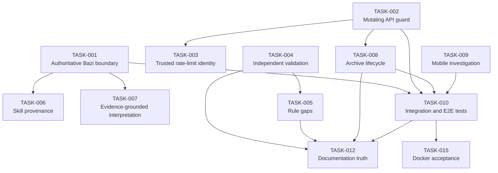

# 2026-08-11 Review Follow-up Task Cards

## Review Summary

This register turns the point-in-time evidence in
[`REVIEW_2026-08-11.md`](./REVIEW_2026-08-11.md) into independently
handoffable work. It merges findings by root cause and does not reopen the
historical T250–T303 cards. Where those cards claim completion without current
acceptance evidence, the new card is a validation/status-gap task rather than a
duplicate implementation task.

## Task Index

| ID | Title | Type | Priority | Risk | Depends On | Status |
| -- | ----- | ---- | -------- | ---- | ---------- | ------ |
| TASK-001 | Establish server-authoritative Bazi input and calculation boundary | SECURITY | P0 | High | — | DONE |
| TASK-002 | Apply a consistent guard to every mutating API route | SECURITY | P0 | High | — | DONE |
| TASK-003 | Make rate-limit identity trustworthy across deployment modes | SECURITY | P1 | High | TASK-002 | DONE |
| TASK-004 | Establish required independent divination validation gates | TEST | P1 | High | — | DONE |
| TASK-005 | Resolve or explicitly bound remaining deterministic rule gaps | TECH_DEBT | P1 | High | TASK-004 | DONE |
| TASK-006 | Make Bazi-skill provenance and adoption auditable | TECH_DEBT | P1 | Medium | TASK-001 | DONE |
| TASK-007 | Ground plain and LLM interpretations in claim-level evidence | UX | P2 | Medium | TASK-001, TASK-006 | DONE |
| TASK-008 | Unify archive lifecycle, sync visibility, and deletion scopes | RELIABILITY | P1 | High | TASK-002 | DONE |
| TASK-009 | Verify and improve mobile critical-flow usability | INVESTIGATION | P2 | Medium | — | DONE |
| TASK-010 | Add API integration, security, and browser E2E coverage | TEST | P1 | High | TASK-001, TASK-002, TASK-008, TASK-009 | DONE |
| TASK-011 | Enforce baseline security headers independent of proxy choice | SECURITY | P2 | Medium | — | DONE |
| TASK-012 | Reconcile documentation, visible copy, and task status with evidence | DOCS | P1 | Medium | TASK-004, TASK-005, TASK-008, TASK-010 | DONE |
| TASK-013 | Remove the accepted lint-warning baseline | TECH_DEBT | P3 | Low | — | DONE |
| TASK-014 | Investigate local cold-start filesystem performance | INVESTIGATION | P3 | Low | — | DONE |
| TASK-015 | Execute and automate Docker runtime acceptance evidence | INFRA | P2 | Medium | TASK-010 | DONE |

## Task Dependency Graph

## Standard Handoff Protocol

Every card below must be checked against the current repository before work.
Before execution: check Git status and actual code; verify the task still
applies; check dependencies; use the current repository as final truth. After
execution: update Status, actual modifications, changed files, verification
results, residual issues, newly discovered tasks, and Commit/PR (if any).

## Task Cards

### TASK-001：Establish server-authoritative Bazi input and calculation boundary

* **Type**：SECURITY
* **Priority**：P0
* **Status**：DONE
* **Risk**：High
* **Dependencies**：无
* **Related Files / Modules**：`src/lib/contracts/charts.ts`, `src/app/api/charts/route.ts`, `src/app/api/reading/route.ts`, `src/lib/bazi/index.ts`, `src/lib/api/validate.ts`, `src/lib/storage/cloud-store.ts`

### Context

The browser computes Bazi charts for immediate display, then submits derived
facts to cloud persistence and LLM narration. Professional-trust claims require
an authoritative server boundary for those facts.

### Problem

`cloudChartUpsertSchema` accepts a minimum client-produced chart with
`.passthrough()`. `POST /api/charts` stores it, and `POST /api/reading`
narrates a client-supplied chart. A signed-in user cannot write another user's
record, but can persist or narrate forged derived facts in their own record.
Expected behavior is server recomputation from validated birth input, or
equivalent full verification.

### Evidence

`src/lib/contracts/charts.ts` defines `baziChartMinSchema` and
`cloudChartUpsertSchema`; `src/app/api/charts/route.ts` calls
`upsertCloudChart`; `src/app/api/reading/route.ts` calls `llmReading`.

### Goal

Define one authoritative Bazi input contract and ensure cloud records and LLM
reports derive deterministic facts from that contract.

### Constraints

Do not remove guest/local instant calculation without a compatible UX path. Do
not trust request `userId` or derived chart/report fields. Preserve ownership,
privacy, and version metadata.

### Acceptance Criteria

* [ ] Problem is resolved or a documented equivalent verification boundary exists
* [ ] Mismatched client-derived facts are rejected or replaced server-side
* [ ] Guest, authenticated save, legacy-record, and LLM paths are verified
* [ ] Cross-user ownership remains intact
* [ ] Focused contract/API tests are added and pass
* [ ] Existing lint / typecheck / test / build checks pass

### Out of Scope

Rewriting Ziwei/Liuyao engines or changing the adopted Bazi school.

### Handoff

Apply the Standard Handoff Protocol above. Inspect contracts, routes, and engine
code before choosing a compatibility/migration strategy.

### TASK-002：Apply a consistent guard to every mutating API route

* **Type**：SECURITY
* **Priority**：P0
* **Status**：DONE
* **Risk**：High
* **Dependencies**：无
* **Related Files / Modules**：`src/lib/api/{parse-body,origin,rate-limit}.ts`, `src/app/api/people/[id]/route.ts`, `src/app/api/{charts,ziwei-charts,liuyao-charts}/[id]/route.ts`, `src/app/api/reading/{liuyao,ziwei}/route.ts`

### Context

The repository already has reusable body parsing and origin validation, but
their use is route-by-route rather than a complete policy.

### Problem

`PUT /api/people/[id]` directly calls `request.json()`. Archive deletion
routes and the non-Bazi reading routes omit `assertSameOrigin`. Expected
behavior is an explicit guard for every write/cost-bearing endpoint: bounded
body, schema validation, authorization, rate policy where appropriate, and
same-origin/CSRF defense.

### Evidence

`src/lib/api/parse-body.ts`; direct `request.json()` in
`src/app/api/people/[id]/route.ts`; absent origin guard in the listed delete
and reading routes.

### Goal

Make request safeguards complete, consistent, and regression-tested across all
mutating routes.

### Constraints

Keep GET/HEAD behavior compatible. Do not treat CORS or SameSite alone as a
complete server-side defense. Preserve error envelopes when clients rely on them.

### Acceptance Criteria

* [ ] Problem is resolved with a documented route-guard policy
* [ ] Every mutating/cost-bearing route has an explicit guard path
* [ ] Oversized, malformed, schema-invalid, unauthenticated, cross-origin, and valid paths are tested as applicable
* [ ] `PUT /api/people/[id]` no longer accepts unbounded/unvalidated input
* [ ] Existing ownership checks remain intact
* [ ] Existing lint / typecheck / test / build checks pass

### Out of Scope

Changing product data fields or replacing sessions.

### Handoff

Apply the Standard Handoff Protocol above. Enumerate all actual route methods;
do not modify only the examples named here.

### TASK-003：Make rate-limit identity trustworthy across deployment modes

* **Type**：SECURITY
* **Priority**：P1
* **Status**：DONE
* **Risk**：High
* **Dependencies**：TASK-002
* **Related Files / Modules**：`src/lib/api/rate-limit.ts`, `src/lib/config/validate-prod.ts`, `docs/DEPLOY.md`, `deploy/{nginx.example.conf,Caddyfile.example}`

### Context

LLM and authentication endpoint limits use `clientKeyFromRequest`.

### Problem

The helper accepts the first `X-Forwarded-For` value directly, so a direct
caller can choose rate-limit keys. Proxy documentation does not itself establish
a trustworthy application boundary.

### Evidence

`clientKeyFromRequest` in `src/lib/api/rate-limit.ts`; proxy guidance in
`docs/DEPLOY.md`.

### Goal

Specify supported proxy/direct modes and derive rate-limit identity from a
trustworthy source in each supported mode.

### Constraints

Do not log raw personal data unnecessarily. Keep Redis fail-fast behavior; do
not silently weaken multi-instance production protection to memory.

### Acceptance Criteria

* [ ] Problem is resolved or unsupported deployment modes fail safely
* [ ] Trusted-proxy assumptions are explicit and tested
* [ ] Spoofed forwarded-header behavior is covered
* [ ] Rate-limit headers and existing buckets remain compatible
* [ ] Required configuration/docs updates are present
* [ ] Existing lint / typecheck / test / build checks pass

### Out of Scope

WAF procurement or provider-specific anti-abuse products.

### Handoff

Apply the Standard Handoff Protocol above. Verify the actual production proxy
topology before making assumptions.

### TASK-004：Establish required independent divination validation gates

* **Type**：TEST
* **Priority**：P1
* **Status**：DONE
* **Risk**：High
* **Dependencies**：无
* **Related Files / Modules**：`package.json`, `scripts/compare-iztro.mjs`, `src/lib/{bazi,ziwei,liuyao}/__fixtures__/**`, `docs/research/**`, `.github/workflows/ci.yml`

### Context

Internal fixtures catch regressions but are not independent proof of
professional-rule correctness.

### Problem

The Bazi source document says >=1,000 external cases are incomplete. `iztro`
is not pinned as a development dependency and its comparison test skips when
absent. Current status labels T262/T271 done despite this gap.

### Evidence

`docs/research/bazi-sources.md`;
`src/lib/ziwei/__fixtures__/iztro-compare.test.ts`;
`scripts/compare-iztro.mjs`; `package.json`; this review's test run reported
one skip.

### Goal

Create a reproducible version-pinned, independently sourced validation program
with CI gates, scoped claims, and structured allowed differences.

### Constraints

Respect licenses/source terms. Do not call self-engine snapshots external
validation. If a desired corpus cannot be obtained, correct the claim rather
than fabricating a count.

### Acceptance Criteria

* [ ] Independent sources, versions, schools, and allowed differences are recorded
* [ ] Required comparison dependencies are pinned or the gate explicitly fails
* [ ] CI executes the chosen independent validation gate
* [ ] Failures emit actionable structured differences
* [ ] Existing internal fixtures remain green
* [ ] Existing lint / typecheck / test / build checks pass

### Out of Scope

Replacing self-developed engines with a third-party runtime dependency.

### Handoff

Apply the Standard Handoff Protocol above. Inspect licensing, fixture metadata,
and CI availability before adding any external data or package.

### TASK-005：Resolve or explicitly bound remaining deterministic rule gaps

* **Type**：TECH_DEBT
* **Priority**：P1
* **Status**：DONE
* **Risk**：High
* **Dependencies**：TASK-004
* **Related Files / Modules**：`src/lib/bazi/{index,solar-time,calendar}/**`, `src/lib/liuyao/analyze/**`, `src/lib/*/references/**`, `docs/research/**`

### Context

Rule-sensitive outcomes need completed, independently tested rules or visible
scope limits.

### Problem

Bazi emits `FLAG_DST_NOT_MODELED` for historical DST/administrative-time gaps.
Project notes also list unfinished Liuyao state-machine coverage. Materiality of
each gap must be verified; it cannot remain implicit behind a completed status.

### Evidence

`src/lib/bazi/index.ts`; known limitations in
`docs/REMEDIATION_TASKS.md` for T260/T281.

### Goal

For each remaining rule gap, make an evidence-backed decision to implement,
display a material uncertainty warning, or explicitly exclude it from supported
scope.

### Constraints

Do not silently change historical outputs or a named-school policy. Version,
evidence, warning, migration, and difference notes must remain coherent.

### Acceptance Criteria

* [ ] Each identified gap has an implementation or scope decision
* [ ] Material uncertainty is visible in output where applicable
* [ ] Changed rules have independent or documented validation coverage
* [ ] Existing chart/version behavior is preserved or safely migrated
* [ ] Research/source documentation is updated
* [ ] Existing lint / typecheck / test / build checks pass

### Out of Scope

New unrelated divination systems or universal cross-school correctness claims.

### Handoff

Apply the Standard Handoff Protocol above. Verify every claimed limitation in
current code before treating it as an implementation defect.

### TASK-006：Make Bazi-skill provenance and adoption auditable

* **Type**：TECH_DEBT
* **Priority**：P1
* **Status**：DONE
* **Risk**：Medium
* **Dependencies**：TASK-001
* **Related Files / Modules**：`scripts/sync-bazi-skill.mjs`, `.agents/skills/bazi/**`, `src/lib/bazi/{index,policy}.ts`, `src/lib/reading/llm/{llm,evidence}.ts`

### Context

The product labels engine output with `skillRef: "bazi-skill"`, creating an
implicit source/provenance claim.

### Problem

No reproducible version/hash connects reports to reviewed skill content, and no
mapping identifies adopted, adapted, or omitted rules. The engine references the
skill but does not execute a general external skill runtime.

### Evidence

`SKILL_REF` in `src/lib/bazi/index.ts`;
`scripts/sync-bazi-skill.mjs`; Bazi prompt in `src/lib/reading/llm/llm.ts`.

### Goal

Make source-skill provenance, rule adoption, and professional-mode disclosure
reproducible and accurate.

### Constraints

Do not expose private local paths/secrets. Respect upstream licensing and retain
the deterministic project engine as source of computation.

### Acceptance Criteria

* [ ] Problem is resolved with reproducible skill/reference identity
* [ ] Adopted/adapted/omitted rule mapping is recorded
* [ ] Report metadata does not imply unsupported runtime execution
* [ ] Reference-content changes produce auditable verification or failure
* [ ] Relevant tests/docs are added
* [ ] Existing lint / typecheck / test / build checks pass

### Out of Scope

Executing an agent skill in the public request path or exposing its full text.

### Handoff

Apply the Standard Handoff Protocol above. Read current skill licensing/content
and sync behavior before defining provenance fields.

### TASK-007：Ground plain and LLM interpretations in claim-level evidence

* **Type**：UX
* **Priority**：P2
* **Status**：DONE
* **Risk**：Medium
* **Dependencies**：TASK-001, TASK-006
* **Related Files / Modules**：`src/lib/reading/template/{plain-copy,analyze,render}.ts`, `src/lib/reading/llm/{llm,parse,safety,evidence}.ts`, `src/components/reading/**`

### Context

The product promises beginner-friendly, non-empty explanations without absolute
or frightening fortune-telling language.

### Problem

Template copy has useful chart anchors but some recommendations are broadly
reusable and not traceable to a chart condition, real-world precondition, or
non-applicable case. LLM safeguards do not require claim-level evidence.

### Evidence

`src/lib/reading/template/plain-copy.ts` includes recommendations such as
`试点→反馈→加注`; `TrustPanel` displays existing evidence.

### Goal

Make each material recommendation explain chart basis, applicable context, and
uncertainty in plain Chinese.

### Constraints

Keep cultural-entertainment positioning, medical/financial cautions, privacy
limits, and deterministic facts immutable by narrative generation.

### Acceptance Criteria

* [ ] Material template/LLM claims link to chart evidence or are removed/rewritten
* [ ] Plain mode is understandable without metaphysics knowledge
* [ ] Advice avoids absolute, fear-inducing, and empty universal wording
* [ ] LLM fallback remains complete and readable
* [ ] Copy/parser/safety tests cover normal and adverse examples
* [ ] Existing lint / typecheck / test / build checks pass

### Out of Scope

Changing calendar calculations or offering paid advisory services.

### Handoff

Apply the Standard Handoff Protocol above. Generate reports from fixed fixtures
before judging copy quality.

### TASK-008：Unify archive lifecycle, sync visibility, and deletion scopes

* **Type**：RELIABILITY
* **Priority**：P1
* **Status**：DONE
* **Risk**：High
* **Dependencies**：TASK-002
* **Related Files / Modules**：`src/lib/storage/{mode,sync,migrate,index}.ts`, `src/components/account/AccountPanel.tsx`, `src/app/{charts,account,people}/**`, `src/app/api/account/**`, `src/app/api/{charts,ziwei-charts,liuyao-charts,people}/**`

### Context

Archives exist in browser storage and optional cloud records across three arts
and person profiles.

### Problem

Account deletion intentionally leaves browser-local data. Sync/migration offers
several manual paths. Archive copy says Ziwei cloud sync is not connected even
though sync functions and login auto-sync exist. Users need explicit local/cloud
choices and predictable recovery/deletion semantics.

### Evidence

`AccountPanel.tsx` discloses retained local data; `src/lib/storage/sync.ts`
implements Bazi/Ziwei/Liuyao push/pull; `src/app/charts/page.tsx` contains
stale Ziwei sync copy.

### Goal

Provide a coherent archive/sync/deletion model with visible status, recoverable
conflict handling, and clear privacy choices.

### Constraints

Never silently erase local/cloud data. Preserve ownership isolation, exports,
migration conflict policy, and account reauthentication.

### Acceptance Criteria

* [ ] All three arts and person data have documented sync/deletion scope behavior
* [ ] Account deletion offers or clearly routes to an explicit local-data decision
* [ ] Sync state, failures, conflicts, and last-result feedback are visible
* [ ] Visible archive copy matches actual behavior
* [ ] Migration/export/delete/restore paths have regression coverage
* [ ] Existing lint / typecheck / test / build checks pass

### Out of Scope

Automatic destructive conflict resolution or changing authentication providers.

### Handoff

Apply the Standard Handoff Protocol above. Map actual local keys, cloud APIs,
and delete paths for every art before changing the UX.

### TASK-009：Verify and improve mobile critical-flow usability

* **Type**：INVESTIGATION
* **Priority**：P2
* **Status**：DONE
* **Risk**：Medium
* **Dependencies**：无
* **Related Files / Modules**：`src/app/globals.css`, `src/components/form/BirthWizard.tsx`, `src/components/chart/**`, `src/components/ziwei/PalaceGrid.tsx`, `src/app/{chart,ziwei,liuyao,account}/**`

### Context

Responsive layouts, safe-area insets, and accessible controls exist in source,
but no repository evidence proves device completion.

### Problem

The previous review could not obtain a trustworthy mobile browser result. The
Ziwei grid is dense on narrow screens; tap targets, overflow, keyboard/date
controls, and report readability remain unconfirmed.

### Evidence

`safe-pad` in `src/app/globals.css`; horizontal overflow chart components;
`PalaceGrid.tsx`; no browser E2E tool/configuration in `package.json`.

### Goal

Establish reproducible mobile evidence and make only evidence-backed UX changes.

### Constraints

Use representative iOS/Android viewport sizes. Do not replace accessible native
form controls without an accessibility justification.

### Acceptance Criteria

* [ ] Investigation records devices/viewports, flows, defects, and artifacts where permitted
* [ ] Three-art creation/reading, archive, login, sync, and deletion are evaluated
* [ ] Ziwei narrow-screen readability is explicitly accepted or given successor tasks
* [ ] Confirmed defects are fixed or receive scoped follow-up cards
* [ ] Feasible automated coverage is added
* [ ] Existing lint / typecheck / test / build checks pass

### Out of Scope

A visual redesign unrelated to proven mobile defects.

### Handoff

Apply the Standard Handoff Protocol above. Confirm a representative device/browser
environment; source inspection alone is not completion evidence.
+
### TASK-010：Add API integration, security, and browser E2E coverage

* **Type**：TEST
* **Priority**：P1
* **Status**：DONE
* **Risk**：High
* **Dependencies**：TASK-001, TASK-002, TASK-008, TASK-009
* **Related Files / Modules**：`.github/workflows/ci.yml`, `package.json`, `src/app/api/**`, `src/lib/**/*.test.ts`, future browser-test configuration

### Context

The current suite is strong for pure functions but insufficient for request
boundaries and workflows crossing authentication, storage, and browser state.

### Problem

There are no route-level attacker tests or browser E2E tests in the repository.
This allowed “full API coverage” documentation to diverge from code and leaves
critical mobile/archive flows unverified.

### Evidence

`package.json` exposes Vitest only; `.github/workflows/ci.yml` runs lint,
unit tests, and build; route tests are absent from `src/app/api/**`.

### Goal

Add maintainable coverage for critical API abuse cases and end-to-end user flows,
then make it a required CI signal.

### Constraints

Tests must not use live LLM credentials, production email, or real user data.
Use isolated temporary stores and do not commit generated artifacts.

### Acceptance Criteria

* [ ] API tests cover size/schema/origin/auth/ownership/rate-limit normal and failure paths
* [ ] Browser E2E covers selected three-art, account, sync, export, and deletion flows
* [ ] Tests run deterministically in CI without live third-party secrets
* [ ] Failure artifacts/logs are actionable and do not leak sensitive data
* [ ] Existing unit suite remains green
* [ ] Existing lint / typecheck / test / build checks pass

### Out of Scope

Full load testing or visual-regression baselines for every page.

### Handoff

Apply the Standard Handoff Protocol above. Confirm dependencies and select a
browser test tool that CI can execute.

### TASK-011：Enforce baseline security headers independent of proxy choice

* **Type**：SECURITY
* **Priority**：P2
* **Status**：DONE
* **Risk**：Medium
* **Dependencies**：无
* **Related Files / Modules**：`next.config.ts`, `deploy/nginx.example.conf`, `deploy/Caddyfile.example`, `docs/DEPLOY.md`

### Context

Security headers exist in proxy examples but not in application configuration.

### Problem

Direct or differently proxied deployments can omit CSP, frame protections,
referrer policy, and permissions policy with no automated detection. Expected
behavior is a documented, tested baseline across supported deployment topologies.

### Evidence

`next.config.ts` has no `headers()` policy; the proxy examples contain the
headers.

### Goal

Define and verify one safe response-header baseline, including CSP compatibility
for Next and permitted external services.

### Constraints

Do not deploy an overly restrictive CSP without testing authentication, exports,
Open Graph images, and intended browser connections. HSTS must be HTTPS-aware.

### Acceptance Criteria

* [ ] Supported deployment modes receive documented security headers
* [ ] CSP/header behavior is tested against core routes
* [ ] Proxy examples and application policy cannot silently contradict each other
* [ ] Header changes do not break intended product flows
* [ ] Deployment documentation is updated
* [ ] Existing lint / typecheck / test / build checks pass

### Out of Scope

Replacing the reverse proxy or adding unrelated auth features.

### Handoff

Apply the Standard Handoff Protocol above. Inspect the actual hosting/proxy
ownership and external-resource requirements first.

### TASK-012：Reconcile documentation, visible copy, and task status with evidence

* **Type**：DOCS
* **Priority**：P1
* **Status**：DONE
* **Risk**：Medium
* **Dependencies**：TASK-004, TASK-005, TASK-008, TASK-010
* **Related Files / Modules**：`docs/{PROJECT_REVIEW,REMEDIATION_TASKS,EXECUTION_GUIDE,QA,DEPLOY}.md`, `README.md`, `CHANGELOG.md`, `src/app/charts/page.tsx`, `docs/tasks/**`

### Context

Documentation and visible product copy are part of professional and operational
trust.

### Problem

Historical Alpha findings and current Beta status are mixed without a strong
historical marker. T253/T262/T271 labels overstate current evidence, and visible
archive copy contradicts implemented Ziwei sync.

### Evidence

`docs/PROJECT_REVIEW.md` reports 56/444 Alpha;
`docs/REMEDIATION_TASKS.md` reports 69/546 and done labels;
`src/app/charts/page.tsx` says Ziwei sync is not connected.

### Goal

Make docs, visible copy, and task statuses accurate, dated, and independently
understandable.

### Constraints

Do not erase historical reviews; label and link them as history. Do not mark a
task done merely because code exists—record acceptance evidence.

### Acceptance Criteria

* [ ] Historical and current review/status documents are clearly distinguished
* [ ] Every reviewed status has evidence or is corrected to TODO/review/blocked
* [ ] Visible sync/storage copy matches actual behavior
* [ ] Review/task/deployment/QA/README/changelog references are cross-checked
* [ ] Documentation links and commands are validated
* [ ] Existing lint / typecheck / test / build checks pass

### Out of Scope

Behavior changes except minimal copy corrections needed for accuracy.

### Handoff

Apply the Standard Handoff Protocol above after dependent evidence is current.

### TASK-013：Remove the accepted lint-warning baseline

* **Type**：TECH_DEBT
* **Priority**：P3
* **Status**：DONE
* **Risk**：Low
* **Dependencies**：无
* **Related Files / Modules**：`src/components/form/BirthWizard.tsx`, `src/lib/auth/session.ts`, `src/lib/liuyao/analyze/index.ts`, `src/lib/ziwei/{aux-stars,boshi,liuchang}.ts`, `.github/workflows/ci.yml`, `package.json`

### Context

CI explicitly accepts up to eight lint warnings.

### Problem

Two warnings identify unsupported ARIA attributes on `role="group"`; remaining
warnings are unused imports. A nonzero baseline weakens the quality signal.

### Evidence

The review command `npm run lint -- --max-warnings=8` reported eight warnings,
including `BirthWizard.tsx` lines 438 and 480.

### Goal

Resolve known warnings and restore a zero-warning CI gate.

### Constraints

Accessibility semantics must improve rather than be suppressed. Do not globally
disable rules to obtain a clean result.

### Acceptance Criteria

* [ ] Current lint warnings are resolved or have a reviewed time-bounded exception
* [ ] Form accessibility behavior is checked
* [ ] CI threshold reflects the achieved warning baseline
* [ ] Relevant tests are updated if behavior changes
* [ ] No existing lint/typecheck/test/build behavior regresses
* [ ] Existing lint / typecheck / test / build checks pass

### Out of Scope

Large formatting-only refactors or unrelated component redesign.

### Handoff

Apply the Standard Handoff Protocol above and rerun lint before acting; this
card's warning list is only a snapshot.

### TASK-014：Investigate local cold-start filesystem performance

* **Type**：INVESTIGATION
* **Priority**：P3
* **Status**：DONE
* **Risk**：Low
* **Dependencies**：无
* **Related Files / Modules**：`package.json`, `next.config.ts`, developer environment documentation if added

### Context

This review observed a slow filesystem warning during development-server cold
compilation.

### Problem

The first `/api/health` request took roughly 26.6 seconds and logged
`Slow filesystem detected`. This may be workstation/workspace-volume specific,
so it is not yet a confirmed production regression.

### Evidence

Next.js 16.2.10 development-server output collected in this review.

### Goal

Determine reproducibility, scope, and a justified remediation or no-action
recommendation.

### Constraints

Do not tune production based on one workstation measurement. Separate cold/warm
framework compilation from application-code work.

### Acceptance Criteria

* [ ] Reproduction method and environment matrix are documented
* [ ] Cold/warm measurements identify filesystem, tooling, or app-code contribution
* [ ] Investigation concludes with a justified fix, environment recommendation, or no-action result
* [ ] Any proposed change is benchmarked against baseline
* [ ] Relevant tests remain green
* [ ] Existing lint / typecheck / test / build checks pass

### Out of Scope

General performance tuning without reproducible evidence.

### Handoff

Apply the Standard Handoff Protocol above and collect controlled local-volume
measurements before modifying config.

### TASK-015：Execute and automate Docker runtime acceptance evidence

* **Type**：INFRA
* **Priority**：P2
* **Status**：DONE
* **Risk**：Medium
* **Dependencies**：TASK-010
* **Related Files / Modules**：`Dockerfile`, `compose.yaml`, `compose.production.yaml`, `.dockerignore`, `docs/DEPLOY.md`, `.github/workflows/docker-build.yml`, `scripts/{db-migrate,validate-prod-env}.mjs`

### Context

Historical W28 records list T300/T301 as review and state that Docker build and
Compose integration were not externally verified.

### Problem

Dockerfiles and docs exist, but source/build success does not prove non-root
runtime, health checks, volumes, migrations, and Compose operate together.

### Evidence

`docs/REMEDIATION_TASKS.md` lists T300/T301 as review; intended runtime files
are listed above.

### Goal

Produce repeatable runtime acceptance evidence and automate an appropriate subset
in CI or a documented release gate.

### Constraints

Use non-production credentials and disposable databases. Do not expose secrets
in logs or image layers. Respect production fail-fast rules.

### Acceptance Criteria

* [ ] Image build, non-root runtime, liveness/readiness, migration, and Compose startup are executed in a controlled environment
* [ ] Persistence is verified across web-container recreation where documented
* [ ] Critical archive/account smoke tests run against the container stack
* [ ] CI or release gate retains reproducible evidence
* [ ] Deployment/QA documentation reflects actual results
* [ ] Existing lint / typecheck / test / build checks pass

### Out of Scope

Public production deployment or cloud-vendor selection.

### Handoff

Apply the Standard Handoff Protocol above. Verify Docker availability and current
deployment files before execution.

## Recommended Execution Order

1. TASK-001 and TASK-002: close P0 trust-boundary and API-policy gaps.
2. TASK-003 and TASK-008: protect cost-bearing requests and make user data
   lifecycle coherent.
3. TASK-004 then TASK-005: establish independent validation before expanding
   or strengthening divination-rule claims.
4. TASK-006 then TASK-007: make provenance and reader-facing reasoning
   evidence-based.
5. TASK-009 then TASK-010: obtain device evidence and automate critical flows.
6. TASK-011, TASK-015, TASK-013, and TASK-014: harden deployment, complete
   runtime evidence, remove lint debt, and investigate the dev signal.
7. TASK-012 last: reconcile public/internal documents after technical evidence
   is current.
